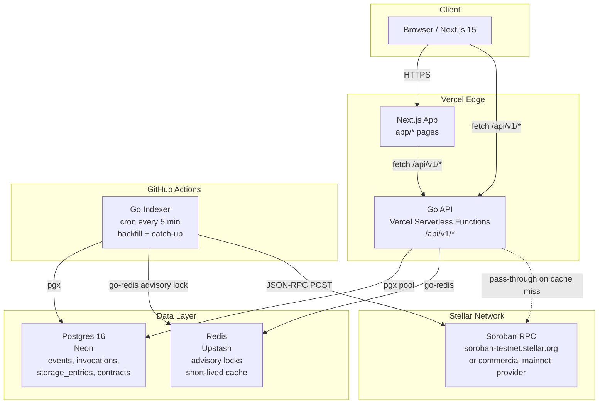

# Architecture
## Sorolens System Architecture

---

## 1. System Diagram



---

## 2. Data Flow

### 2.1 Backfill of a newly tracked contract

This flow runs when a contract ID is first submitted to the system (either via the dashboard UI or the CLI `sorolens track <contract-id>`).

```
1. API receives POST /api/v1/contracts
   - Validates the contract ID (StrKey C-address format)
   - Calls RPC getNetwork to confirm the node is reachable
   - Calls RPC getLedgerEntries for the contract instance entry
     - If not found: return 404 (contract does not exist on-chain)
   - Inserts row into `contracts` table with status = "backfilling"
   - Returns 201 Created

2. On next cron run (at most 5 minutes later), the indexer sees
   the contract in "backfilling" status.

3. Indexer sets a Redis advisory lock:
   SET sorolens:lock:backfill:<contract_id> <job_id> NX PX 300000
   (300-second TTL; if already set, skip this contract for this run)

4. Indexer determines backfill range:
   - Calls RPC getLatestLedger -> current_ledger
   - start_ledger = current_ledger - 120,960 (approximately 7 days at 5s/ledger)
   - If network only retains 24h of events, start_ledger is adjusted to
     current_ledger - 17,280 (approximately 1 day at 5s/ledger)

5. Indexer calls RPC getEvents in paginated batches:
   params: {
     startLedger: start_ledger,
     filters: [{ type: "contract", contractIds: [contract_id] }],
     pagination: { limit: 1000 }
   }
   Repeats with cursor until no more pages.

6. For each event batch:
   - Decode XDR ScVal topics and value (via a local XDR library)
   - Upsert into `events` table (on conflict: skip duplicate by event `id`)

7. For each unique txHash seen in events:
   - Call RPC getTransaction for any txHash not already in `invocations`
   - Parse status, result_xdr, and resource fees from resultXdr.feeCharged
   - Upsert into `invocations` table

8. Call RPC getLedgerEntries for the contract instance + any known
   persistent storage keys (empty set on first backfill):
   - Insert/update `storage_entries` table with current liveUntilLedgerSeq

9. Update `contracts` table: status = "active", backfill_complete_at = now()
   Update `sync_state` table: last_ledger = current_ledger

10. Release Redis advisory lock (DELETE key).
```

### 2.2 Incremental catch-up (every cron run)

This flow runs for all contracts in "active" status on every 5-minute cron tick.

```
1. Indexer acquires global Redis advisory lock:
   SET sorolens:lock:global_run <job_id> NX PX 290000
   (290-second TTL; shorter than cron interval to prevent overlap)
   If lock is already held: exit immediately (previous run still in progress).

2. Indexer queries `sync_state` for each tracked contract:
   SELECT s.contract_id, s.last_ledger
   FROM sync_state s
   JOIN contracts c ON c.id = s.contract_id
   WHERE c.status = 'active'

3. Calls RPC getLatestLedger -> current_ledger

4. For each contract, calls RPC getEvents:
   params: {
     startLedger: last_ledger + 1,
     endLedger: current_ledger,
     filters: [{ type: "contract", contractIds: [contract_id] }],
     pagination: { limit: 1000 }
   }
   Paginates until exhausted.

5. Same upsert logic as backfill steps 6-8.

6. Refresh `storage_entries` for all keys belonging to active contracts
   by calling getLedgerEntries in batches of 100 keys.

7. Update `sync_state.last_ledger = current_ledger` for each contract.

8. Release the global Redis lock.
```

---

## 3. Postgres Schema (DDL)

```sql
-- ============================================================
-- contracts
-- Tracks each contract being observed.
-- ============================================================
CREATE TABLE contracts (
    id             TEXT        PRIMARY KEY,          -- StrKey C-address, e.g. "CDLZFC3S..."
    network        TEXT        NOT NULL,              -- "testnet" | "mainnet"
    label          TEXT,                              -- human-readable name (optional)
    wasm_hash      TEXT,                              -- hex WASM hash from getLedgerEntries
    created_at_ledger  BIGINT,                        -- ledger at which contract was deployed
    backfill_complete_at TIMESTAMPTZ,
    status         TEXT        NOT NULL DEFAULT 'pending',  -- pending | backfilling | active | paused | error
    added_at       TIMESTAMPTZ NOT NULL DEFAULT NOW()
);

-- Fast lookup by network when listing all tracked contracts.
CREATE INDEX idx_contracts_network ON contracts (network);

-- ============================================================
-- events
-- One row per emitted contract event.
-- ============================================================
CREATE TABLE events (
    id             TEXT        PRIMARY KEY,           -- RPC event id, e.g. "0000859036408881152-0000000003"
    contract_id    TEXT        NOT NULL REFERENCES contracts (id),
    ledger         BIGINT      NOT NULL,
    ledger_closed_at TIMESTAMPTZ NOT NULL,
    tx_hash        TEXT        NOT NULL,
    type           TEXT        NOT NULL,              -- "contract" | "system"
    topic_xdr      JSONB       NOT NULL,              -- array of base64 XDR ScVal strings
    value_xdr      TEXT        NOT NULL,              -- base64 XDR ScVal string
    topic_decoded  JSONB,                             -- decoded human-readable topics (null until decoded)
    value_decoded  JSONB,                             -- decoded human-readable value (null until decoded)
    in_successful_call BOOLEAN NOT NULL DEFAULT TRUE,
    inserted_at    TIMESTAMPTZ NOT NULL DEFAULT NOW()
);

-- Primary query pattern: all events for a contract, newest first.
CREATE INDEX idx_events_contract_ledger ON events (contract_id, ledger DESC);

-- Support filtering by transaction hash (e.g., "show all events in this tx").
CREATE INDEX idx_events_tx_hash ON events (tx_hash);

-- Time-range queries from the dashboard.
CREATE INDEX idx_events_ledger_closed_at ON events (ledger_closed_at DESC);

-- ============================================================
-- invocations
-- One row per transaction that invoked (or attempted to invoke)
-- a tracked contract.
-- ============================================================
CREATE TABLE invocations (
    tx_hash            TEXT        PRIMARY KEY,
    contract_id        TEXT        NOT NULL REFERENCES contracts (id),
    ledger             BIGINT      NOT NULL,
    ledger_closed_at   TIMESTAMPTZ NOT NULL,
    status             TEXT        NOT NULL,          -- SUCCESS | FAILED | NOT_FOUND
    function_name      TEXT,                          -- decoded from diagnosticEventsXdr fn_call, may be null
    args_decoded       JSONB,                         -- decoded function arguments, may be null
    result_decoded     JSONB,                         -- decoded return value, may be null
    result_xdr         TEXT,                          -- raw base64 TransactionResult XDR
    resource_fee_charged BIGINT,                      -- in stroops, from TransactionResult.feeCharged
    cpu_insn           BIGINT,                        -- from core_metrics diagnostic event
    mem_byte           BIGINT,                        -- from core_metrics diagnostic event
    ledger_read_byte   BIGINT,                        -- from core_metrics diagnostic event
    ledger_write_byte  BIGINT,                        -- from core_metrics diagnostic event
    application_order  INTEGER,                       -- index of tx within the ledger
    inserted_at        TIMESTAMPTZ NOT NULL DEFAULT NOW()
);

-- Primary query pattern: all invocations for a contract, newest first.
CREATE INDEX idx_invocations_contract_ledger ON invocations (contract_id, ledger DESC);

-- Lookup by ledger close time for time-range dashboard queries.
CREATE INDEX idx_invocations_ledger_closed_at ON invocations (ledger_closed_at DESC);

-- Filter by status (e.g. "show only failed invocations").
CREATE INDEX idx_invocations_status ON invocations (contract_id, status);

-- ============================================================
-- storage_entries
-- Snapshot of current contract storage state.
-- Updated on every indexer run for all active contracts.
-- ============================================================
CREATE TABLE storage_entries (
    id                     BIGSERIAL   PRIMARY KEY,
    contract_id            TEXT        NOT NULL REFERENCES contracts (id),
    key_xdr                TEXT        NOT NULL,       -- base64 XDR LedgerKey
    key_decoded            JSONB,                      -- decoded key (null until decoded)
    value_xdr              TEXT,                       -- base64 XDR LedgerEntry (null if archived)
    value_decoded          JSONB,                      -- decoded value (null until decoded or if archived)
    durability             TEXT        NOT NULL,       -- "temporary" | "persistent" | "instance"
    live_until_ledger      BIGINT,                     -- liveUntilLedgerSeq from getLedgerEntries; null if archived
    last_modified_ledger   BIGINT,
    status                 TEXT        NOT NULL DEFAULT 'live',  -- live | archived | deleted
    last_seen_at           TIMESTAMPTZ NOT NULL DEFAULT NOW(),
    UNIQUE (contract_id, key_xdr)
);

-- TTL health dashboard: "show all entries expiring within N ledgers".
CREATE INDEX idx_storage_live_until ON storage_entries (contract_id, live_until_ledger ASC)
    WHERE status = 'live';

-- Filter by durability type.
CREATE INDEX idx_storage_durability ON storage_entries (contract_id, durability);

-- ============================================================
-- sync_state
-- One row per tracked contract, tracking indexer cursor position.
-- ============================================================
CREATE TABLE sync_state (
    contract_id    TEXT        PRIMARY KEY REFERENCES contracts (id),
    last_ledger    BIGINT      NOT NULL DEFAULT 0,     -- last fully-processed ledger
    last_run_at    TIMESTAMPTZ,
    error_message  TEXT,                               -- last error, if any
    updated_at     TIMESTAMPTZ NOT NULL DEFAULT NOW()
);
```

### Index justifications

| Index | Justification |
|---|---|
| `idx_contracts_network` | Dashboard lists contracts per network; network filter is the most common WHERE clause on the contracts table. |
| `idx_events_contract_ledger` | The most common dashboard query: "show me recent events for contract X." Composite index with ledger DESC avoids sort. |
| `idx_events_tx_hash` | Supports the invocation-detail page which shows all events emitted in a given transaction. |
| `idx_events_ledger_closed_at` | Time-range filtering on the events feed. |
| `idx_invocations_contract_ledger` | Same pattern as events; the invocation list is paginated with newest-first ordering. |
| `idx_invocations_ledger_closed_at` | Time-range filter for resource-usage charts. |
| `idx_invocations_status` | Supports the "show only failures" filter on the invocations list. |
| `idx_storage_live_until` | The TTL health view needs to order by `live_until_ledger ASC` for a given contract; partial index on `status = 'live'` avoids scanning archived rows. |
| `idx_storage_durability` | Supports filtering the storage view by entry type. |

---

## 4. REST API: `/api/v1`

All routes return `Content-Type: application/json`. Errors follow:

```json
{ "error": "human readable message", "code": "ERROR_CODE" }
```

Request bodies are capped at 1 MiB by default. A request whose
`Content-Length` exceeds the cap is rejected before its body is read, and any
other body is bounded with `http.MaxBytesReader`; both paths return `413` with:

```json
{ "error": { "code": "PAYLOAD_TOO_LARGE", "message": "request body exceeds the 1048576 byte limit", "request_id": "..." } }
```

Set `REQUEST_MAX_BODY_BYTES` to change the cap.

Cursor pagination uses an opaque `cursor` token (base64 of `{ledger}:{id}`) rather than offset. This is safe against inserts during pagination and aligns with how the RPC itself paginates.

#### Authentication and scopes

Every list endpoint accepts an optional `?network=testnet|mainnet|futurenet`
filter (omitted or `all` means every network).

Requests may carry a scoped API key via `Authorization: Bearer <token>` or
`X-API-Key: <token>`. Scope enforcement is driven by a route metadata table
keyed by the chi route pattern (`internal/middleware/scopes.go`):

| Scope | Grants |
|---|---|
| `read:contracts` | contract, event, invocation, storage, stats, and snapshot reads |
| `write:contracts` | `POST /api/v1/contracts` |
| `read:watchdog` | all `/api/v1/watchdog/*` reads |
| `admin:*` | everything, including API key management |

A presented key that lacks the required scope receives `403` with
`{"error":"missing scope","required":"<scope>"}`. Unknown or revoked keys
receive `401`. Requests that present no credential keep the public v0.1 read
surface open; API key management always requires a credential.

#### Profiling: `/debug/pprof/*`

The Go runtime profiling handlers (`net/http/pprof`) are mounted on the same
router at `/debug/pprof/*` but are admin-only. Every request from a caller
without the `admin` role — anonymous requests included — receives `403`, so
the surface is not advertised. An admin gets the standard pprof index at
`/debug/pprof/` and the named profiles (`goroutine`, `heap`, `allocs`, …),
`cmdline`, `profile`, `symbol` and `trace` beneath it.

---

### 4.1 Contracts

#### `POST /api/v1/contracts`

Register a contract for tracking.

**Request body:**
```json
{
  "contract_id": "CDLZFC3SYJYDZT7K67VZ75HPJVIEUVNIXF47ZG2FB2RMQQVU2HHGCYSC",
  "network": "testnet",
  "label": "My Token Contract"
}
```

**Responses:**
- `201 Created`: contract accepted for backfill.
- `400 Bad Request`: invalid contract ID format or missing fields.
- `404 Not Found`: contract does not exist on-chain (getLedgerEntries returned no entry).
- `409 Conflict`: contract already being tracked.

---

#### `GET /api/v1/contracts`

List all tracked contracts.

**Query params:** `network` (filter by network), `status` (filter by status).

**Response `200`:**
```json
{
  "contracts": [
    {
      "id": "CDLZFC3S...",
      "network": "testnet",
      "label": "My Token Contract",
      "status": "active",
      "wasm_hash": "a1b2c3d4...",
      "added_at": "2026-07-01T10:00:00Z"
    }
  ]
}
```

---

#### `GET /api/v1/contracts/:id`

Get a single contract's metadata and sync state.

**Response `200`:**
```json
{
  "id": "CDLZFC3S...",
  "network": "testnet",
  "label": "My Token Contract",
  "status": "active",
  "wasm_hash": "a1b2c3d4...",
  "backfill_complete_at": "2026-07-01T10:05:00Z",
  "sync": {
    "last_ledger": 490252,
    "last_run_at": "2026-07-26T10:00:00Z"
  },
  "storage_entry_count": 42,
  "expiring_entry_count": 3
}
```

**Responses:** `200`, `404 Not Found`.

---

#### `DELETE /api/v1/contracts/:id`

Stop tracking a contract. Data is retained but the indexer stops polling.

**Response:** `204 No Content`.

---

### 4.2 Events

#### `GET /api/v1/contracts/:id/events`

Paginated event list for a contract.

**Query params:**

| Param | Type | Default | Notes |
|---|---|---|---|
| `cursor` | string | (none) | Opaque cursor from previous response. |
| `limit` | integer | 50 | Max 500. |
| `topic` | string | (none) | Filter: match events where topic[0] decodes to this symbol string. |
| `tx_hash` | string | (none) | Filter by transaction hash. |
| `since` | ISO-8601 | (none) | Return events after this timestamp. |
| `until` | ISO-8601 | (none) | Return events before this timestamp. |

**Response `200`:**
```json
{
  "events": [
    {
      "id": "0000859036408881152-0000000003",
      "ledger": 200010,
      "ledger_closed_at": "2025-06-30T07:27:13Z",
      "tx_hash": "d9e771ac...",
      "type": "contract",
      "topic_decoded": ["transfer", "GABC...", "GDEF..."],
      "value_decoded": "1000000000",
      "in_successful_call": true
    }
  ],
  "cursor": "0000863490289963008-0000000010",
  "has_more": true
}
```

#### `GET /api/v1/contracts/:id/events.csv`

Flat CSV export of a contract's events, for handing the whole history to a
spreadsheet or an analyst in one request. Rows are streamed straight from the
query, so memory use in the API does not grow with the size of the export.
Served as a download with `Content-Type: text/csv; charset=utf-8` and
`Content-Disposition: attachment; filename="<id>-events.csv"`.

**Query params:** `network`, `type`, `from` / `to` (inclusive ledger bounds).
`topic` and `in_successful_call` are not supported here, and there is no `cursor`
and no `limit`: an export is meant to be complete.

**Columns** (in order): `id`, `contract_id`, `network`, `ledger`,
`ledger_closed_at`, `tx_hash`, `type`, `topic_xdr`, `value_xdr`,
`topic_decoded`, `value_decoded`, `in_successful_call`. The three `*_xdr` /
`*_decoded` columns hold JSON.

**Responses:**
- `200`: the header row, then one row per matching event ordered by
  `(ledger, id)` ascending. The export is deterministic, so an unchanged store
  produces an identical file and a diff means the data changed. An unknown
  contract yields the header row with no data rows, matching the JSON listing.
- `422`: `network` is not a known network, a ledger bound is not a positive
  integer, or `from` is greater than `to`.

Two details worth knowing before opening a downloaded file:

- Free-text columns (`type`, `value_xdr`) are prefixed with an apostrophe when
  they start with `=`, `+`, `-` or `@`, because a spreadsheet would otherwise
  evaluate a contract-supplied value as a formula. The JSON columns are left
  alone: they always open with a bracket, a quote or a digit.
- The response is committed as soon as the first byte is written, so a store
  failure part-way through a large export is logged rather than turned into an
  error status. A failure before any row is written still answers `500` with a
  JSON error body.

---

### 4.3 Invocations

#### `GET /api/v1/invocations`

Global invocation explorer: resource usage for every tracked contract, newest
first (`ledger DESC, tx_hash DESC`). Backs the dashboard's `/invocations` page.

**Query params:** `cursor`, `limit` (default 50, max 200), `contract_id`, `fn`
(function name), `status` (`SUCCESS`/`FAILED`/`NOT_FOUND`), `network`, `from` /
`to` (ledger bounds), `since` / `until` (inclusive `ledger_closed_at` bounds, as
`YYYY-MM-DD` or RFC3339).

Pagination is keyset-based: the cursor encodes the `(ledger, tx_hash)` position,
which is the sort tuple, so pages stay stable while the indexer appends rows.

**Response `200`:**
```json
{
  "invocations": [
    {
      "tx_hash": "32f7e5c3...",
      "contract_id": "CDLZFC3SYJYDZT7K67VZ75HPJVIEUVNIXF47ZG2FB2RMQQVU2HHGCYSC",
      "network": "testnet",
      "ledger": 490252,
      "ledger_closed_at": "2026-07-26T10:00:21Z",
      "status": "SUCCESS",
      "function_name": "transfer",
      "resource_fee_charged": 123456,
      "cpu_insn": 4883530,
      "mem_byte": 2298162,
      "ledger_read_byte": 21812,
      "ledger_write_byte": 1808
    }
  ],
  "next_cursor": "NDkwMjUyOmFiYzEyMw=="
}
```

`next_cursor` is an empty string on the last page. Invalid `cursor`, `since`,
`until`, or `network` values return `422`.

---

#### `GET /api/v1/contracts/:id/invocations`

Paginated invocation list.

**Query params:** `cursor`, `limit` (max 500), `status` (`SUCCESS`/`FAILED`), `since`, `until`, `function_name`.

**Response `200`:**
```json
{
  "invocations": [
    {
      "tx_hash": "32f7e5c3...",
      "ledger": 490252,
      "ledger_closed_at": "2026-07-26T10:00:21Z",
      "status": "SUCCESS",
      "function_name": "transfer",
      "args_decoded": { "from": "GABC...", "to": "GDEF...", "amount": "1000000000" },
      "result_decoded": null,
      "resource_fee_charged": 123456,
      "cpu_insn": 4883530,
      "mem_byte": 2298162,
      "ledger_read_byte": 21812,
      "ledger_write_byte": 1808
    }
  ],
  "cursor": "490200:abc123",
  "has_more": false
}
```

---

#### `GET /api/v1/contracts/:id/invocations/:tx_hash`

Full detail for a single invocation, including all associated events.

**Response `200`:**
```json
{
  "tx_hash": "32f7e5c3...",
  "ledger": 490252,
  "ledger_closed_at": "2026-07-26T10:00:21Z",
  "status": "SUCCESS",
  "function_name": "transfer",
  "args_decoded": { ... },
  "result_decoded": null,
  "result_xdr": "AAAAAAAHNm8A...",
  "resource_fee_charged": 123456,
  "cpu_insn": 4883530,
  "mem_byte": 2298162,
  "ledger_read_byte": 21812,
  "ledger_write_byte": 1808,
  "events": [ ... ]
}
```

**Responses:** `200`, `404 Not Found`.

---

### 4.4 Storage Entries

#### `GET /api/v1/contracts/:id/storage`

Paginated storage entry list.

**Query params:** `cursor`, `limit` (max 200), `durability` (`temporary`/`persistent`/`instance`), `status` (`live`/`archived`), `expiring_within` (integer: show only entries with `live_until_ledger - current_ledger <= N`).

**Response `200`:**
```json
{
  "current_ledger": 490314,
  "entries": [
    {
      "key_xdr": "AAAA...",
      "key_decoded": "Balance",
      "value_xdr": "AAAABg...",
      "value_decoded": { "GABC...": "1000000000" },
      "durability": "persistent",
      "live_until_ledger": 490600,
      "ledgers_until_expiry": 286,
      "status": "live",
      "last_modified_ledger": 489200
    }
  ],
  "cursor": "490200:key123",
  "has_more": true
}
```

---

### 4.5 Snapshot / replay

#### `GET /api/v1/contracts/:id/snapshot?ledger=N`

Replays the contract's storage state and last known event as they were at
ledger `N`. Used by the ledger scrubber on the contract detail page.

**Responses:**
- `200`: `{ contract_id, network, ledger, first_tracked_ledger, storage, last_event }`.
- `404`: contract is unknown, or `N` precedes the first ledger the contract
  was tracked at (the message names that ledger).
- `422`: `ledger` is missing or not a positive integer.

---

#### `GET /api/v1/contracts/:id/snapshot.json`

Portable JSON export of the contract's current state: the four sections
`metadata`, `storage`, `events`, and `summary`, wrapped in a versioned
envelope (`schema_version`, `contract_id`, `network`, `ledger`). The document
is deterministic for an unchanged store (stable field order, sorted
collections, no wall-clock fields), so exports can be archived or diffed.
Served with `Content-Type: application/json; charset=utf-8` and
`Content-Disposition: attachment; filename="<id>-snapshot.json"`; when the
client sends `Accept-Encoding: gzip` the body is gzip-compressed.

**Responses:**
- `200`: the four-section export described above.
- `404`: contract is unknown.

---

### 4.6 API keys

Scoped credentials are managed under `/api/v1/api-keys` and require the
`admin:*` scope.

#### `POST /api/v1/api-keys`

Create a key. Body: `{ "name": string, "scopes": string[] }`. Returns `201`
with the plaintext `key` exactly once; only its SHA-256 hash is persisted.

#### `GET /api/v1/api-keys`

List key metadata (never the token).

#### `DELETE /api/v1/api-keys/:id`

Revoke a key. Returns `204`.

---

### 4.7 Stats

#### `GET /api/v1/stats/global`

Network-wide summary across all tracked contracts.

**Response `200`:**
```json
{
  "tracked_contracts": 12,
  "total_events_indexed": 48210,
  "total_invocations_indexed": 9347,
  "failed_invocation_count": 134,
  "avg_cpu_insn_last_1000": 5234000,
  "avg_resource_fee_last_1000": 98234,
  "expiring_storage_entries_7d": 8,
  "oldest_indexed_ledger": 400000,
  "latest_indexed_ledger": 490314,
  "indexer_last_run_at": "2026-07-26T10:00:01Z"
}
```

---

### 4.8 Request timeouts

Every `/api/v1` route runs under `API_REQUEST_TIMEOUT` (default 30s,
`middleware.Timeout`, built on `http.TimeoutHandler`). The request context is
cancelled at the deadline so in-flight store queries abort, and a handler that
has not finished gets a `503` with the standard error envelope
(`code: TIMEOUT`). The response is buffered, so late writes from a slow handler
are discarded instead of racing the 503.

`GET /api/v1/stream/events` (SSE) is registered outside that cap and runs
under `API_STREAM_TIMEOUT` (default 5m, `middleware.StreamTimeout`): the
response is not buffered, the connection write deadline is extended to match,
and at the deadline the context is cancelled so the stream closes and
`EventSource` reconnects. The server `WriteTimeout` is set to
`API_REQUEST_TIMEOUT + 5s` so it never cuts off the 503.

---

### 4.9 Live dashboard feeds

The `/live` page (issue #139) polls two bounded, non-paginated reads.

#### `GET /api/v1/events/recent?limit=50`

The newest events across every tracked contract, ordered by
`ledger_closed_at DESC`. The ticker de-duplicates by event `id`, so no cursor is
needed and a repeated poll that returns already-rendered rows is a no-op.

#### `GET /api/v1/stats/activity?minutes=30`

One entry per contract that emitted at least one event in the last `minutes`
minutes, ordered hottest first. Each entry carries `per_minute`: exactly
`minutes` one-minute buckets, oldest first, zero-filled. Bucket boundaries are
aligned to the wall-clock minute so two consecutive polls agree on the x-axis
and a sparkline never shifts under the reader.

#### `POST /api/v1/contracts/validate`

Read-only pre-flight check for the tracking wizard (issue #140). Body:
`{"contract_id": "C...", "network": "testnet"}`. It validates the StrKey —
base32-decoding the payload, checking the contract version byte, and verifying
the CRC16-XModem checksum — which catches a mistyped character that the
length-only check used by registration cannot. It also reports
`already_tracked` so the wizard can redirect instead of creating a duplicate.
It never writes.

---

### 4.10 API v2

`/api/v2/*` mirrors `/api/v1/*` route for route with a consistent response
contract:

- every list endpoint returns
  `{"data": [...], "pagination": {"next_cursor", "has_more"}}`
- every list endpoint accepts `cursor` and `limit`, and always returns
  `pagination`
- every timestamp is RFC 3339 UTC; optional fields are explicit `null`
- errors keep the v1 `{"error": {"code", "message", "request_id"}}` shape

Scopes and roles are identical in both namespaces. `docs/api-v2.md` is the
field-by-field v1 → v2 mapping, and `docs/openapi.yaml` documents both
namespaces. Route parity is enforced by `TestV2CoversEveryV1Route`, which walks
the chi route table and fails if a v1 route has no v2 counterpart.

---

## 5. Design Decisions with Rationale

### 5.1 Cron-driven indexer over a persistent worker

**Decision:** The indexer runs as a GitHub Actions scheduled workflow on a 5-minute cron, not as a long-running process.

**Rationale:**
- Zero hosting cost (GitHub Actions free tier covers this comfortably at 5-minute intervals for a small number of contracts).
- No server to maintain or restart. Vercel and Neon are both serverless; the indexer being serverless is architecturally consistent.
- GitHub Actions provides logging, history, and alerting for free.

**Tradeoffs:**
- 5-minute minimum latency for new events. For an observability tool (not a trading system), this is acceptable.
- Cold start on each run adds a few seconds of overhead.
- Cannot hold long-running TCP connections to Soroban RPC (unnecessary; RPC is HTTP).

**Migration path to a persistent worker:** When event volume or contract count makes 5-minute cron latency unacceptable, extract the indexer binary and run it as a Fly.io Machine (free tier) or a Railway worker. The indexer already exposes a `Run()` function with a configurable poll interval; no structural change is required. The Redis advisory lock mechanism is already in place to prevent duplicate runs regardless of how the indexer is deployed.

---

### 5.2 HTTP polling over SSE for the live-tail

**Decision:** The dashboard live-tail polls `GET /api/v1/contracts/:id/events` every 5 seconds instead of opening a long-lived SSE stream.

**Rationale:** Vercel serverless functions have a maximum execution time (approximately 60 seconds for Pro, 10 seconds for free). Long-lived SSE connections are not supported on Vercel serverless. HTTP polling with a 5-second interval and a cursor is the only viable approach without a separate persistent WebSocket server.

**Tradeoffs:** Five-second polling has slightly higher latency than SSE and uses more requests. For an observability tool where data is already indexed with 5-minute granularity, this is acceptable. Clients deduplicate by event `id`.

**Migration path:** If Sorolens is ever deployed with a persistent server, replace the polling client code with an SSE or WebSocket endpoint backed by a Go `net/http` SSE handler. The API contract (cursor-based event list) does not change.

---

### 5.3 Redis advisory lock for single-writer indexer runs

**Decision:** Before each indexer run, the indexer acquires a Redis key with `SET ... NX PX <ttl>`. If the key already exists, the run exits immediately.

**Rationale:** GitHub Actions cron workflows can overlap if a previous run is still in progress. Two concurrent indexer processes writing to Postgres would produce duplicate events and undefined `sync_state` updates. The Redis lock provides a cheap, stateless mutual exclusion mechanism with automatic expiry (the lock self-releases if the indexer crashes without deleting it).

Upstash Redis is used because it is serverless (no idle cost), has a free tier, and supports the standard Redis `SET NX PX` command.

**Lock TTL:** 290 seconds (just under the 5-minute cron interval). This ensures the lock always expires before the next cron tick, even if the indexer crashes without releasing it explicitly.

---

### 5.4 Cursor pagination over offset

**Decision:** All list endpoints use cursor-based pagination via an opaque `cursor` string, not `?page=N&limit=M` offset pagination.

**Rationale:**
- Events and invocations are append-only. During pagination, new rows are inserted. Offset pagination produces duplicate or missing rows if a page boundary shifts between requests.
- Cursor pagination is stable: the cursor encodes the position (ledger + id) of the last returned row, not an offset.
- Aligns with how Soroban RPC itself paginates `getEvents`.
- Postgres `WHERE (ledger, id) < (cursor_ledger, cursor_id) ORDER BY ledger DESC, id DESC LIMIT N` uses the composite index efficiently.

**Tradeoff:** Clients cannot jump to an arbitrary page number. This is acceptable for an observability dashboard where users scroll through a feed; it is not a spreadsheet export use case.

---

### 5.5 A parallel v2 namespace over a frozen v1

**Decision:** Introduce `/api/v2/*` as a new route subtree rather than
versioning individual endpoints or rewriting v1 in place.

**Rationale:** v1 is consumed by the dashboard, the CLI, and the generated Go
client simultaneously. Changing its response shapes would break all three at
once. A parallel namespace lets the accumulated inconsistencies be fixed
(uniform list envelope, unambiguous field names, ISO 8601 timestamps
everywhere) without a coordinated client migration, and lets each consumer move
endpoint by endpoint. Both namespaces share the same store and middleware, so
there is no duplicated query logic and scopes and roles behave identically.

**Tradeoff:** Two handler layers must be kept in step. A route-parity test
guards the surface mechanically, and the DTO duplication is deliberate: that
duplication *is* the versioning contract.

---

### 5.6 Parquet cold storage with a pure-Go reader

**Decision:** Events older than `COLD_STORAGE_THRESHOLD_DAYS` (default 90) are
exported to Parquet objects in an S3-compatible bucket and then deleted from
Postgres. A scheduled job (`apps/api/cmd/coldarchive`) performs the export, and
the API falls back to the archive when a queried ledger range is no longer in
the hot store.

**Rationale:** Postgres storage is the dominant cost at scale, while historical
events are read rarely and almost always in ledger order. One Parquet object per
contract per calendar month keeps reads cheap and the layout comprehensible by
non-Go tools.

**Write-before-delete:** export and delete are separate steps, and the delete
only runs after the object is durable, so a failed upload can never lose data.
Re-archiving a month merges into the existing object and de-duplicates by event
id, which makes the job idempotent and safe to re-run.

**Not embedded DuckDB:** the issue suggested loading the Parquet with DuckDB
embedded. That requires cgo and a multi-minute C++ build in every environment
that compiles the API, including CI, so the reader uses a pure-Go Parquet
library instead. The on-disk format is unchanged, so a DuckDB-backed reader can
consume the same objects later without a migration.

**Tradeoff:** an archive-backed query lists and decodes every object for the
contract, so it is materially slower than the Postgres path. That is the
accepted cost of the cold tier (issue #146 asks for "slower but succeeds"), and
the one-object-per-month layout bounds the work to the months touched.

---

### 5.7 PWA / Web Push (issue #275)

**Decision:** Ship installability and push-notification delivery as a Progressive Web App (Workbox service worker + VAPID Web Push) rather than a native mobile wrapper.

**Rationale:** A PWA requires no App Store review cycle, works on all major mobile browsers, and can be maintained purely within the existing Next.js codebase. VAPID push is the W3C standard supported natively by all modern browsers and does not require any cloud push SDK.

**New API surface** (Next.js App Router route handlers in `apps/web/app/api/push/`):

| Method | Path | Purpose |
|--------|------|---------|
| `GET`  | `/api/push/vapid-public-key` | Returns the VAPID public key for `PushManager.subscribe()`. Public by design. |
| `POST` | `/api/push/subscribe`        | Saves a `PushSubscription` JSON blob (endpoint + keys) to the server-side store. |
| `DELETE`| `/api/push/subscribe`       | Removes a subscription by endpoint. |
| `PUT`  | `/api/push/subscribe`        | Internal endpoint: fans out a push payload to all stored subscriptions. Auth-guarded by `PUSH_INTERNAL_SECRET`. |

**Environment variables** (server-side only — never `NEXT_PUBLIC_*`):

| Variable | Purpose |
|----------|---------|
| `VAPID_PUBLIC_KEY`   | Base64url-encoded EC P-256 public key |
| `VAPID_PRIVATE_KEY`  | Base64url-encoded EC P-256 private key |
| `VAPID_SUBJECT`      | Contact URI for the VAPID JWT (`mailto:` or `https:`) |
| `PUSH_INTERNAL_SECRET` | Shared secret for the `PUT` push-send endpoint |

**#127 dependency:** Issue #127 ("pluggable notification channels") specifies Slack/Discord/PagerDuty integrations, not Web Push. The server-side alert-triggered push path is **stubbed** — the `PUT /api/push/subscribe` route exists and works, but the indexer/notifier does not yet call it. When #127 or a dedicated push-delivery issue lands, the notifier should call `PUT /api/push/subscribe` with `x-push-secret: $PUSH_INTERNAL_SECRET` when a Critical alert fires. This is documented in `apps/web/app/api/push/subscribe/route.ts`.

**Subscription persistence:** The current `POST /api/push/subscribe` stores subscriptions in-process (a `Map`). This is lost on serverless cold starts. Before enabling push in production, replace the `Map` with a Postgres table (a simple `push_subscriptions(endpoint TEXT PK, keys JSONB, created_at TIMESTAMPTZ)` suffices) and call the Go API to persist it.

**Client-side PWA components:**
- `apps/web/public/manifest.webmanifest` — Web App Manifest with icons, shortcuts, and `display: standalone`.
- `apps/web/next.config.ts` — wraps Next.js with `@ducanh2912/next-pwa` (Workbox) to generate a service worker that precaches the app shell and runtime-caches API responses (stale-while-revalidate, 5-minute TTL).
- `apps/web/lib/alertQueue.ts` — IndexedDB-backed offline alert queue (via `idb`).
- `apps/web/hooks/useOfflineAlertQueue.ts` — React hook that reads/writes the queue and tracks `navigator.onLine`.
- `apps/web/hooks/usePushSubscription.ts` — React hook managing the push subscription lifecycle (idle → subscribing → subscribed → denied).
- `apps/web/components/OfflineAlert.tsx` — `OfflineBanner` (shown when offline) + `OfflineAlertPanel` (the `/offline-alerts` page body).
- `apps/web/app/offline-alerts/page.tsx` — dedicated page for the queued-alert view.
