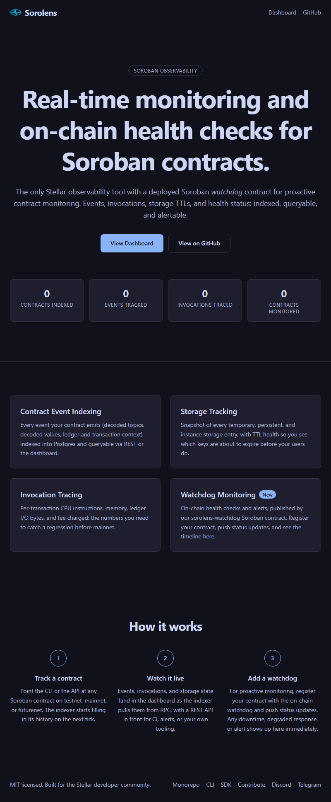
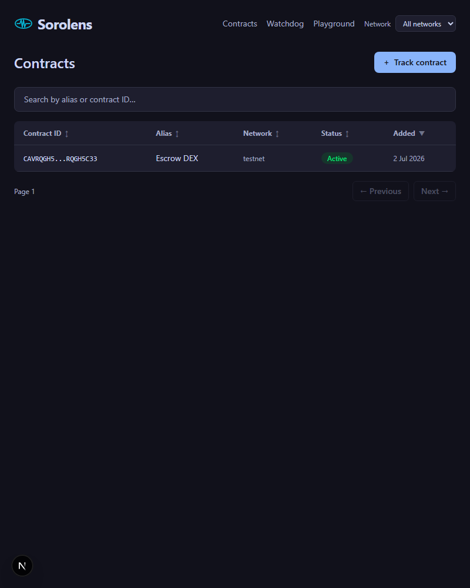
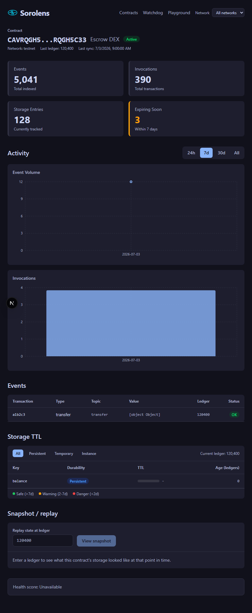
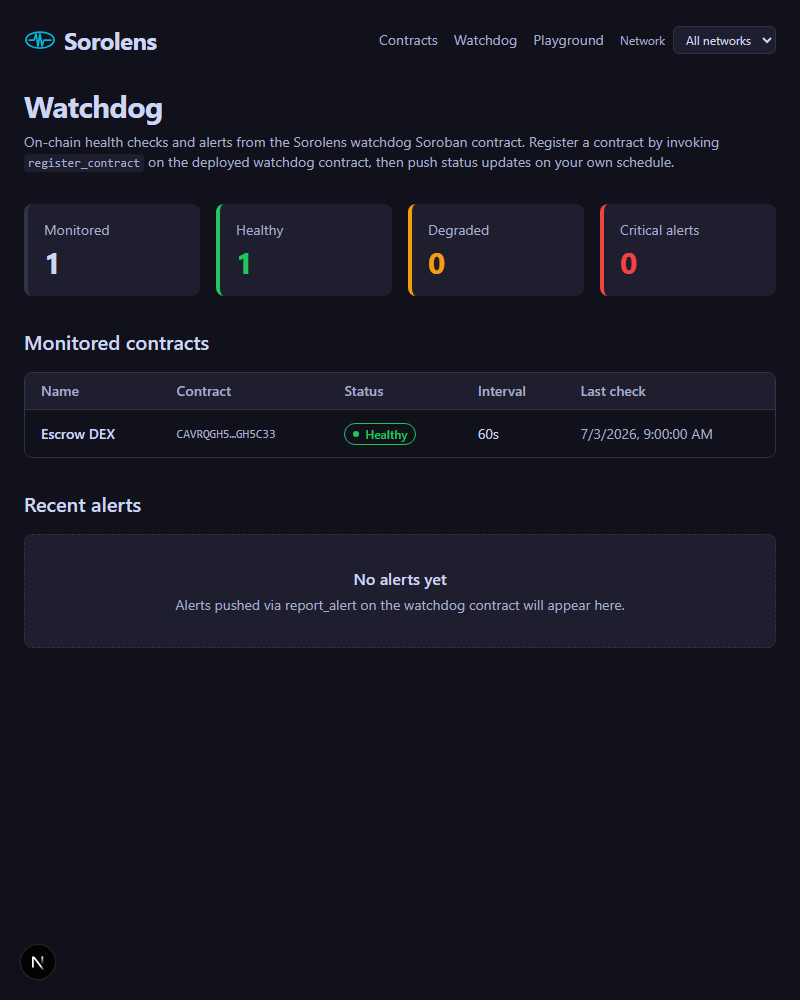
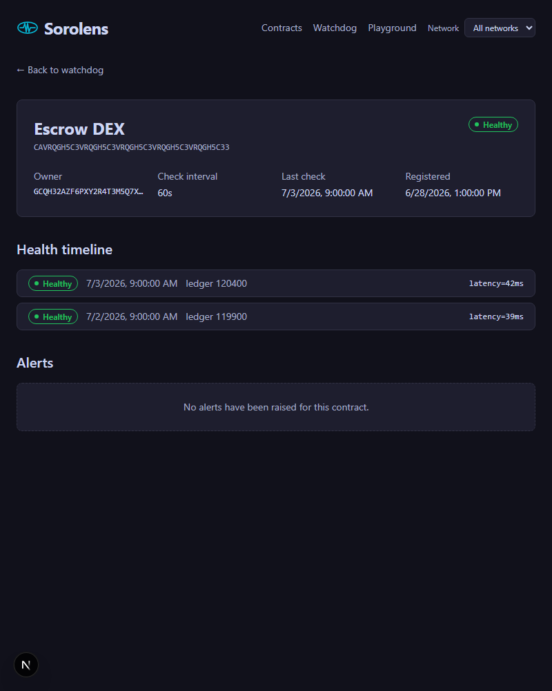

[](https://github.com/sorolens/sorolens/actions/workflows/ci.yml)
[](https://codecov.io/gh/sorolens/sorolens)
[](./LICENSE)
[](https://github.com/sorolens/sorolens/releases/latest)
[](https://discord.gg/D9jATUezYX)
[](https://t.me/sorolens_community)
[](https://github.com/sorolens/sorolens/discussions)
[](https://goreportcard.com/report/github.com/sorolens/sorolens/apps/api)
[](https://goreportcard.com/report/github.com/sorolens/sorolens/services/indexer)
# Sorolens
Real-time monitoring, alerting, and on-chain health checks for Soroban smart contracts on Stellar. The only observability tool in the Stellar ecosystem with a deployed Soroban **watchdog** contract for proactive contract monitoring.
---
## The problem
Soroban's public RPC retains events for 24 hours and transaction data for up to 7 days. There is no persistent index of what your contract did, what it cost, or which storage entries are close to expiring. The Stellar Lab contract explorer is excellent for point-in-time inspection but has no history, no API, and no way to know when a contract you depend on is unhealthy. Sorolens fills that gap.
---
## What it does
- **Contract event indexing**: every event your contract emits, with decoded topics and values, indexed into Postgres and queryable via REST.
- **Invocation tracing**: per-transaction CPU instructions, memory, ledger I/O bytes, and fees charged.
- **Storage tracking**: snapshot of every temporary, persistent, and instance storage entry, with TTL health.
- **Watchdog monitoring** *(new)*: the on-chain `sorolens-watchdog` Soroban contract lets any contract owner register a contract, push health status, and raise alerts. Sorolens indexes those events and materialises them into a dashboard, giving you the only proactive-monitoring path on Stellar without a centralised heartbeat service.
- **Alerting**: when persistent storage entries are within a configurable number of ledgers of expiry, or when a monitored contract goes `Unresponsive`.
- **Multi-network**: track and query testnet, mainnet, and futurenet contracts side by side, with a network selector in the dashboard header and a `?network=` filter on every list endpoint.
- **Snapshot / replay**: `GET /api/v1/contracts/:id/snapshot?ledger=N` replays a contract's storage state and last known event as of any ledger, with a ledger scrubber on the contract page for time-travel debugging.
- **Scoped API keys**: per-key permissions (`read:contracts`, `write:contracts`, `read:watchdog`, `admin:*`) enforced by route metadata, so a monitoring bot can hold a read-only watchdog key.
- **API playground**: an interactive `/playground` page to explore every endpoint, send requests, and copy them as curl.
- **Build introspection**: `GET /api/version` returns the running API's `version`, `git_sha`, and `built_at` (injected at build time via `-ldflags`, falling back to `dev` locally). It is unauthenticated and does no database or Redis work, so deploy checks and uptime monitors can poll it cheaply.

## Quickstart
### Prerequisites
- Docker and Docker Compose
- Go 1.23+
- Node 22+ and pnpm 9+
### 1. Start local dependencies
```bash
docker compose up -d
```
This starts Postgres 16 and Redis locally. The `docker-compose.yml` at the repo root maps Postgres to `localhost:5432` and Redis to `localhost:6379`.
### 2. Apply the database schema
The one-shot `migrate` service applies `apps/api/internal/db/migrations/*.up.sql` on first start, so the schema is ready once it finishes (`docker compose logs -f migrate`). To reset to an empty database instead, run `docker compose down -v` and start again.
### 3. Track a contract and run the indexer
```bash
# Register a contract (uses the local API)
go run ./cmd/sorolens track CDLZFC3SYJYDZT7K67VZ75HPJVIEUVNIXF47ZG2FB2RMQQVU2HHGCYSC --network testnet
# Run one indexer cycle manually
go run ./cmd/sorolens index --once
```
The dashboard is at `http://localhost:3000` after `pnpm dev` in `apps/web`.
---
## How to contribute

1. **Find an issue** – Browse the [open issues](https://github.com/sorolens/sorolens/issues) and pick one that interests you. Look for labels like `good first issue` or `help wanted`.
2. **Claim it** – Comment "I'd like to work on this" on the issue. A maintainer will assign it to you.
3. **Open a PR** – Follow the branch naming and commit conventions in [CONTRIBUTING.md](./CONTRIBUTING.md) and open a pull request against `main`.

See [CONTRIBUTING.md](./CONTRIBUTING.md) for the full walkthrough, including local setup, running tests, and the PR checklist.

Real-time chat with maintainers and other contributors: [**join the Sorolens Discord**](https://discord.gg/D9jATUezYX). Announcements, PR reviews, weekly office hours, and a live GitHub activity feed all live there. Prefer Telegram? Mirror is at [t.me/sorolens_community](https://t.me/sorolens_community); Discord is the primary hub.

---
## Community

Sorolens is developed in the open, and most of the conversation happens in real time:

| Channel | Where | What it is for |
|---|---|---|
| **Discord** | [discord.gg/D9jATUezYX](https://discord.gg/D9jATUezYX) | Primary hub — live chat with maintainers, PR reviews, weekly office hours, and the live GitHub activity feed. Setup and code questions go in `#help`; PRs that need eyes in `#reviews-wanted`. |
| **Telegram** | [t.me/sorolens_community](https://t.me/sorolens_community) | Mirror group with topic-based channels, for those who prefer Telegram. |
| **GitHub Discussions** | [sorolens/sorolens/discussions](https://github.com/sorolens/sorolens/discussions) | Long-form questions, design proposals, and show-and-tell that should stay searchable beyond chat scrollback. |

The GitHub issue thread remains the source of truth for any individual change. For behaviour expectations in these spaces, see [CODE_OF_CONDUCT.md](./CODE_OF_CONDUCT.md).

---
## Architecture

```
             +-------------------+       +--------------------+
             |   Soroban RPC     | <---- |  Sorolens indexer  |
             +-------------------+       |  (Go, GH Actions)  |
                                         +--------+-----------+
                                                  |
                                                  v
     +-----------------+     +-------+     +---------------+     +-------------+
     |  Watchdog       |     |       |     |  Postgres 16  | <-- |  REST API   |
     |  (Soroban)      |==>events==>|     |  (Neon)       |     |  (Go, Vercel)|
     +-----------------+     +-------+     +---------------+     +------+------+
                                                                        |
                                                                        v
                                                                +---------------+
                                                                |  Next.js 15   |
                                                                |  dashboard    |
                                                                |  (Vercel)     |
                                                                +---------------+
```

## Screenshots

### Landing page



### Contracts list



### Contract detail



### Watchdog overview



### Watchdog contract detail



The **watchdog contract** at `contracts/watchdog/` is the piece that makes Sorolens unique: contracts you operate emit `HealthCheckEvent`, `ContractAlert`, `ContractRegistered`, and `ContractDeregistered` on-chain, the indexer picks them up along with everything else, and the dashboard renders your fleet's live health.

> See `ARCHITECTURE.md` for the full system diagram, data flows, schema DDL, and REST API reference.

### API reference

The REST API is described by an OpenAPI 3.0 spec at [`docs/openapi.yaml`](docs/openapi.yaml). Load it into Swagger UI, Redoc or Postman, or generate a client from it (the Go client in `packages/go-client` is generated this way). Run `make openapi` after changing a route: it fails if any route is undocumented, lints the spec with Redocly, and regenerates the Go client.

---
## Deployed contracts

### Testnet

| Contract | ID | Explorer |
|----------|----|----------|
| Watchdog | `CACXRL67WL5KRD6HKWGYADHEUF6RQOCODUN26UQE7MGFZEMIR7PAX6R7` | [Stellar Expert](https://stellar.expert/explorer/testnet/contract/CACXRL67WL5KRD6HKWGYADHEUF6RQOCODUN26UQE7MGFZEMIR7PAX6R7) |

Admin: `GAZ3HN2QNDKWLOI2OQEG65KBJEAUP4PROR3FJNXNDY34UH547MN4CJUI`

### Mainnet

| Contract | ID | Explorer | Status |
|----------|----|----------|--------|
| Watchdog | _TBA — not deployed yet_ | — | ⏳ Coming soon |

> ⏳ **Coming soon.** Mainnet is on the roadmap. The row above is a placeholder: the mainnet contract ID and explorer link will be published here once the deployment is live.

---
## Tech stack
| Layer | Technology |
|---|---|
| API | Go 1.23, chi, pgx v5, deployed as Vercel serverless functions |
| Indexer | Go 1.23, runs as a GitHub Actions scheduled workflow (5-minute cron) |
| Database | Postgres 16, hosted on Neon |
| Cache / locks | Redis, hosted on Upstash |
| Dashboard | Next.js 15, TypeScript, Tailwind CSS, deployed on Vercel |
| XDR decoder | TypeScript package (`packages/xdr`), wraps `@stellar/stellar-sdk` |
| CLI | Go 1.23, cobra |
| Go client | Generated from [`docs/openapi.yaml`](docs/openapi.yaml) into `packages/go-client` |
| Python client | Generated from [`docs/openapi.yaml`](docs/openapi.yaml) into `packages/python-sdk` (sync + async, published to PyPI as `sorolens`) |
| Fixture contract | Rust (stable), Soroban SDK, deployed to Stellar testnet |
| Watchdog contract | Rust (stable), Soroban SDK, on-chain health tracking (`contracts/watchdog`) |
---
## Monorepo layout
```
sorolens/
  apps/
    api/          Go API (Vercel serverless functions)
    web/          Next.js 15 dashboard (landing page + /contracts + /watchdog + /playground)
  services/
    indexer/      Go indexer worker (+ internal/watchdog event classifier)
  packages/
    xdr/          TypeScript XDR decoder
    ui/           Shared React UI primitives
    go-client/    Auto-generated Go API client (from docs/openapi.yaml)
    python-sdk/   Official Python API client, sync + async (from docs/openapi.yaml)
  cli/            Go CLI (cobra)
  contracts/
    counter/      Rust Soroban fixture contract
    watchdog/     Rust Soroban watchdog contract (on-chain health tracking)
  docs/
    screenshots/  Screenshot placeholders
```

### Python SDK

[`packages/python-sdk`](./packages/python-sdk) ships the official `sorolens` Python client: a generated
low-level layer built from [`docs/openapi.yaml`](docs/openapi.yaml) plus a hand-written facade with sync
and async transports.

```python
from sorolens import Client

with Client(api_key="sk_live_...") as client:
    print(client.stats.global_stats().tracked_contracts)
    for contract in client.contracts.list(limit=10).contracts:
        print(contract.id, contract.status)
```

See [`packages/python-sdk/README.md`](./packages/python-sdk/README.md) for the quickstart, API reference
and release process.

### The watchdog vertical

| Layer | Location |
|---|---|
| On-chain contract | `contracts/watchdog/src/lib.rs` (`register_contract`, `report_status`, `report_alert`, `get_all_monitored`, ...) |
| Deploy script | `contracts/watchdog/scripts/deploy-testnet.sh` |
| Event classifier | `services/indexer/internal/watchdog/classifier.go` |
| Postgres schema | `apps/api/internal/db/migrations/000002_watchdog.up.sql` (`monitored_contracts`, `health_checks`, `contract_alerts`) |
| Store methods | `apps/api/internal/store/watchdog.go` |
| REST endpoints | `GET /api/v1/watchdog/{stats,contracts,alerts,contracts/{id}/{health,alerts}}` |
| Dashboard pages | `apps/web/app/(app)/watchdog/*` |
---
## Contributing
### See [CONTRIBUTING.md](./CONTRIBUTING.md) for local setup, branch conventions, commit format, and a full walkthrough of adding a new XDR type decoder.
---
## Code of conduct
### See [CODE_OF_CONDUCT.md](./CODE_OF_CONDUCT.md).
---

## Contributors

Thanks to everyone who has contributed to Sorolens!

[](https://github.com/sorolens/sorolens/graphs/contributors)


## License
MIT. See [LICENSE](./LICENSE).
